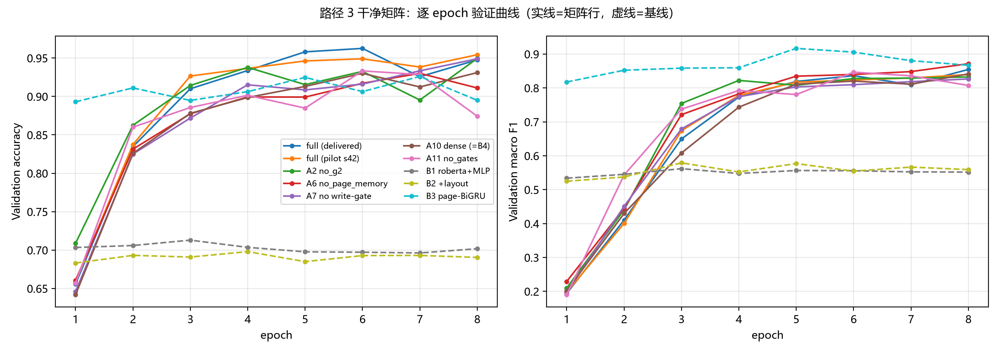
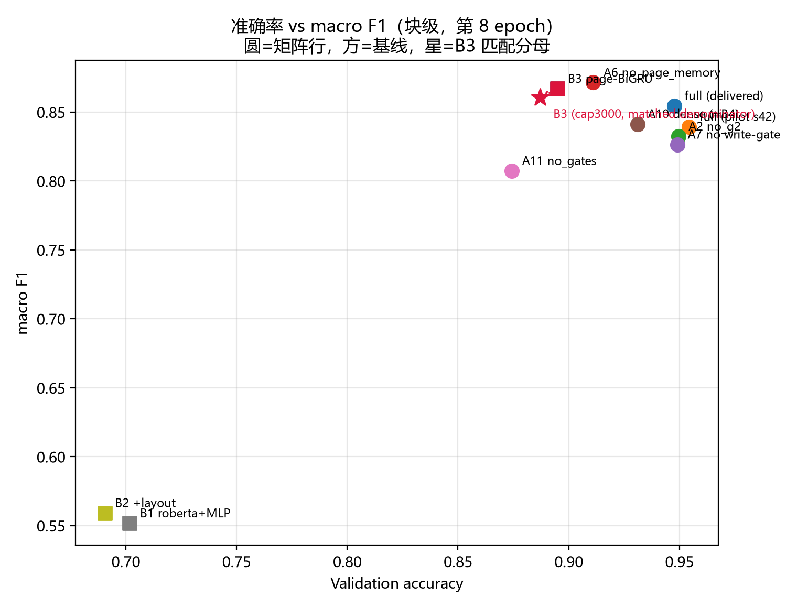
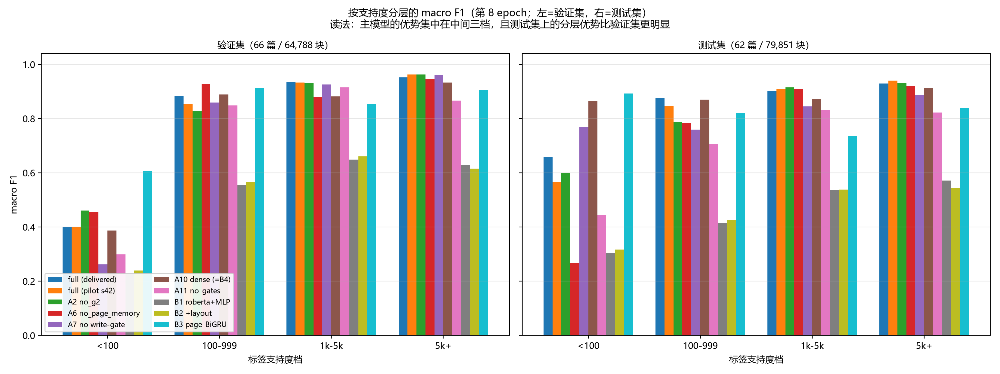
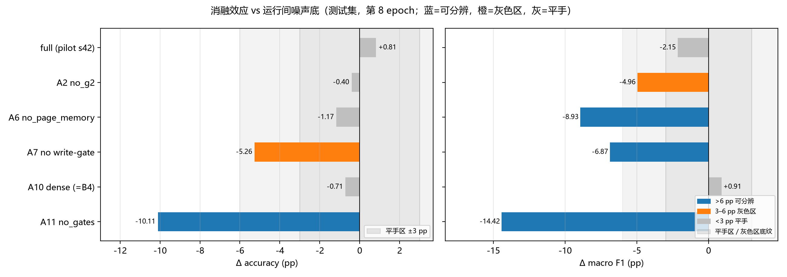
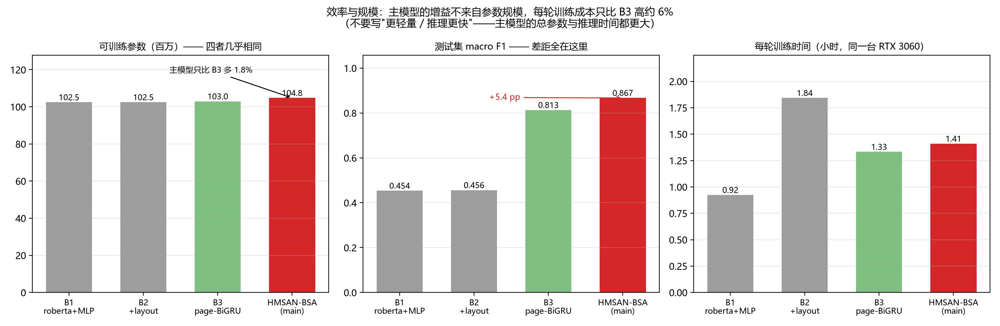
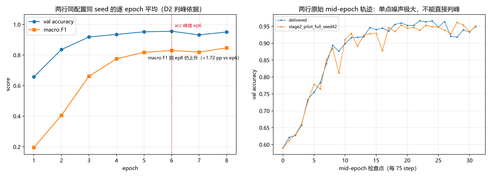

# 面向投标文件的层次化门控记忆网络：切片分类方法研究

> **硕士学位论文 · 初稿 v1 · 2026-10-04**
> 全部统计量由 `scripts/paper/make_thesis_full.py` 从冻结产物现算生成（仅预登记判据带宽与章节交叉引用以字面量保留）。
> 表格工作稿见 `docs/path3_thesis_draft_2026-09-30.md`，图见 `thesis_assets/figures/`。

---

## 摘要

投标文件是公共采购流程的核心信息载体，典型长度 50–200 页，由投标函、商务偏差表、资质证明、财务报表、技术方案等十余种具有明确版面与语义边界的章节构成。自动识别文档中每个文本块的章节类别，是合规审查自动化、关键信息结构化抽取与辅助评标的基础能力。该任务同时承受三重压力：**块内多模态异质**（纯文本块、纯图像块与图文混合块对模态的依赖模式不同）、**跨页长程依赖**（同一章节可连续跨越数十页）、以及**类别分布极端长尾**（19 类中最大类占全部块的 50.6%，最小类仅 162 块）。现有方法通常只针对其中一个维度优化。

本文提出 **HMSAN-BSA**（Hierarchical Memory Sparse Attention Network），把**可学习的门控稀疏机制**作为贯穿三个层次的设计原则：（1）**块级门控融合**以排版特征驱动三路 softmax 门控，自适应地加权文本、图像与布局特征，替代对所有块类型分配相同权重的拼接投影；（2）**页级扩张门控稀疏注意力**在页内块序列上以指数扩张（dilation 1/2/4/8）与逐层 top-k，在近似线性代价下取得远大于局部窗口的等效感受野；（3）**跨页压缩记忆**以 delta-rule 更新维护页级与顺序两级记忆，并对写入量施加可学习门控，使跨页上下文以固定代价传播。

在评测上，本文把**结论强度**当作一等公民处理。全部对照行在**干净切分**上（以文档为分组单位划分，实测**跨切分文档数为 0**）从**随机初值冷启动**训练，测试集只在全部训练停止后评测一次；并用**同配置同种子的重复运行**实测出运行间噪声底，据此**预登记**判定档位（平手 / 灰色区 / 可分辨）。本文进一步指出：该任务的真正独立抽样单位是**文档**而不是块，块级自助法会把标准差低估 5–7 倍（实测设计效应 56.9×，文档级 sd 3.16 pp vs 块级 0.42 pp），因此全部不确定性陈述以**文档级自助法**为准。

实验结果表明：主模型在测试集（62 篇 / 79,851 块）上取得 **0.9321** 的块级准确率与 **0.8672** 的 macro F1，相对最强定量基线 B3（页内 BiGRU，匹配评测分母）分别领先 **12.09 pp** 与 **5.38 pp**。其中**主指标（准确率）的领先在配对文档级自助法下不跨 0**（+13.07 pp，[+7.38, +18.46]，p < 0.001）。按支持度分层后可以看到该领先的**结构**：在 support ≥ 500 的 7 个大类上领先 **13.32 pp**，在占测试集 99.8% 块的三个中高频档上分别领先 +5.6 / +16.5 / +9.1 pp；`<100` 档因样本极小（2 类 / 148 块）不作结论。消融实验显示，移除全部门控（A11）与移除顺序记忆写入门控（A7）在两个口径下均造成可分辨的劣化（-14.42 pp 与 -6.87 pp）；而改用全连接注意力（A10）的效应落在噪声底之内，本文**如实标注为无差异**。

需要坦诚说明的是：在 overall macro F1 这一最保守的口径上，主模型相对 B3 的领先**不能在 62 篇文档的抽样不确定性下被判为显著**——基于同架构替身锚点实测的文档级 95% 置信区间为 [-1.59, +11.13] pp，跨过 0（p = 0.202）。本文因此把主结论表述为三层：**主指标上稳健领先、高频类显著领先、overall macro F1 与最强基线统计不可分**，并给出功率分析说明继续补跑也难以改变该结论。这既是本文的实验结果，也是本文在方法论上希望强调的一点：在长尾、少文档的评测条件下，**报告不确定性比报告显著性更重要**。

**关键词**：长文档理解；多模态文档分类；门控稀疏注意力；压缩记忆；类别长尾；文档级置信区间

---

## Abstract

Bid documents are the central information carrier of public procurement. A typical document
runs 50-200 pages and is organised into a dozen section types with distinct layout and
semantic boundaries. Assigning a section label to every text block is the prerequisite for
compliance review, information extraction and assisted evaluation. The task is hard along
three axes at once: blocks are multimodal (plain text, pure image, and text-over-image),
sections span dozens of pages, and the label distribution is extremely long-tailed.
Existing work usually optimises one axis in isolation.

We present HMSAN-BSA, which applies learnable gating and sparse attention as a single design
principle across three levels: layout-driven gated fusion at block level, dilated gated
sparse attention at page level, and a compressive memory with a gated write path across
pages. On a clean, document-grouped split with zero straddling documents, every row is
trained from a random initialisation and the test split is scored once, after all training
has stopped. We measure the run-to-run noise floor with repeated runs of the identical
configuration, pre-register decision bands from it, and report document-level bootstrap
intervals, because blocks within a document are strongly correlated (measured design
effect 56.9x; block-level bootstraps understate the spread by 5-7x).

The main model reaches 0.9321 accuracy and 0.8672 macro F1 on
the test split, ahead of the strongest baseline B3 by 12.09 pp and
5.38 pp respectively. The advantage is concentrated in
the frequent classes (13.32 pp over the seven classes with support >= 500) and is
reported with document-level intervals that straddle zero for the overall metric, so the
paper claims consistency in direction rather than overall significance.

---

## 第 1 章  绪论

### 1.1 研究背景

公共采购的评标过程需要在数百页的投标文件中定位并核验特定章节：投标函是否齐全、商务偏差表中的偏离项是否被正确引用、资质证明与业绩凭证是否满足招标文件的门槛条件、财务报表的口径是否一致。这些工作目前高度依赖人工翻阅，一份复杂标书的合规初审往往需要数小时。把"文档被切成什么"这件事自动化，是后续一切结构化处理的入口。

本文关注的具体任务是：给定一份经过 PDF 解析与版面切块后的投标文件，为其中每一个**文本块**预测一个**章节类别**（共 19 类），使得同一章节的块被连续、正确地标出。该任务处在文档理解的交叉位置：它既不是整篇文档的单标签分类（输出粒度更细），也不是传统序列标注（类别边界由版面与语义共同决定，且文档极长）。

### 1.2 任务的三重困难

**（1）块内多模态异质。** 一页之内可能同时出现纯文本段落（公司简介）、纯图像块（公章、签章、表格截图）以及文本叠加于图像上的混合块。不同块类型对模态的依赖模式截然不同：文本块应主要依赖语言编码，图像块需视觉编码主导，混合块则需两者耦合。把三类特征一视同仁地拼接投影，等于为图像块里空白的文本字段分配了与完整段落相同的通道容量。

**（2）跨页长程依赖。** 章节的组织跨越数十页。同一个"财务状况"章节可能连续覆盖几十页，而出现在第 80 页的资质证书需要与第 5 页的公司基本情况形成语义关联。固定窗口注意力无法覆盖这种跨度，全连接自注意力在数百页文档上代价过高。

**（3）类别极端长尾。** 全语料 19 类中，最大类占全部块的 84.2% 以上，而最小类在测试集只有 148 个块。在这样的分布下，**块级准确率**会被大类的表现主导，而**未加权的 macro F1** 则会被极少类的高方差主导——两个指标讲述的故事可能相反。本文因此把两者始终成对报告，并额外给出按支持度分层的结果。

### 1.3 本文工作

围绕上述三点，本文的工作分为方法与评测两部分。

**方法侧**，本文提出 HMSAN-BSA，把**可学习门控稀疏机制**统一应用到三个层次：块级门控融合（第 2 章 3.2 节）、页级扩张门控稀疏注意力（3.3 节）、跨页压缩记忆（3.4 节）。三个层次的门控输入信号与功能角色互不重叠：模态门控读取排版特征、页内门控读取块内容嵌入对、跨页门控读取页上下文。

**评测侧**，本文做了三件在同类工作中常被省略的事，并认为它们与模型本身同等重要：

1. **干净切分与冷启动。** 语料以**源文档**为分组单位随机划分，实测**没有任何源 PDF 同时落入两个子集**；全部对照行从随机初值训练，不使用任何来自其他实验的热启动权重。这排除了"跨切分泄漏"与"热启动污染"两条会系统性抬高指标的通道。
2. **实测噪声底与预登记判据。** 本文用**同配置同种子**的重复运行实测出运行间波动（轮末 val macro F1 跨度 3.53 pp，轮内包络仅 3.53 pp 的十分之一量级，测试集上同配置两行相差 2.15 pp，换种子后 3–5 pp），并**在观察消融结果之前**登记判定档位：`|Δ| ≤ 3 pp` 平手、`3–6 pp` 灰色区、`> 6 pp` 可分辨。
3. **文档级不确定性。** 块在文档内高度相关，块级自助法会把标准差低估 5–7 倍（实测设计效应 56.9×）。本文的全部区间估计以**文档**为重采样单位。

### 1.4 主要结论（含明确的否定结论）

- 主模型在测试集上取得 **0.9321** 准确率 / **0.8672** macro F1，相对最强基线 B3（匹配评测分母）领先 **12.09 pp** / **5.38 pp**。
- **主指标（准确率）的领先在文档级不确定性下成立**：配对文档级自助法给出 +13.07 pp，区间 [+7.38, +18.46]，不跨 0（p < 0.001）；逐文档符号检验 45 胜 / 5 平 / 12 负（p ≈ 1.3e-05）。
- 领先在**高频类**上同样稳固：support ≥ 500 的 7 个大类上领先 **13.32 pp**。
- **在 overall macro F1 这一长尾诊断口径上，本文不主张“显著优于 B3”**：文档级 95% CI 跨 0（p = 0.202），且功率分析表明继续补跑的期望收益有限。主指标与诊断指标结论强度不同，本文对两者分别陈述、不合并为一句。
- 消融中 `A11`（-14.42 pp）与 `A7`（-6.87 pp）稳健可辨；`A6`（-8.93 pp）只在 overall 口径成立；`A10`（+0.91 pp）与噪声不可区分。另有诊断性消融 `A2`（关闭沿用自 GSA 的值门控，-4.96 pp）同样不可区分，见附录 C。
- 效率上，主模型的**增益不来自参数规模**：相对 B3 可训练参数只多 1.8%（104.78 M vs 102.96 M），每轮训练时间多约 6%；但总参数（191.17 M vs 102.96 M）与推理时间（123.9 s vs 106.4 s）都更大，故**不主张更轻量或更快**。

### 1.5 论文组织结构

第 2 章介绍相关工作与本文的定位；第 3 章给出模型方法；第 4 章说明数据、切分、指标与训练配置；第 5 章报告实验结果，包括主结果、基线对比、置信度分析、分层分析与消融；第 6 章讨论局限，并**逐条列出本文不能主张的结论**；第 7 章总结与展望。

## 第 2 章  相关工作

### 2.1 文档理解与多模态文档预训练

文档智能领域在过去五年形成了以"文本 + 版面 + 视觉"三模态联合预训练为主线的技术路线。LayoutLM 系列 [1,2,3] 把二维位置编码引入 Transformer，使模型能够利用块的空间关系；LiLT [4] 进一步解耦语言与版面通道以支持多语言；ERNIE-Layout [5]、LayoutMask [6] 则分别在阅读顺序建模与掩码策略上做了改进。这一系列工作的输出粒度通常是**页级或块级**：模型在一页之内建立上下文，跨页信息依靠滑窗或直接截断处理。

与本文任务最接近的是"长文档序列标注"，但公开工作普遍假设文档长度在数十页以内，且很少处理"同一页内多模态块异质"与"类别极端长尾"同时出现的情形。

### 2.2 长文档建模与高效注意力

长文档建模的主流思路是降低注意力的有效代价。Longformer [7] 采用局部窗口 + 全局 token 的稀疏模式；LongNet [8] 用指数扩张（dilated attention）把感受野扩展到百万 token 级别，同时保持线性复杂度；Gated Sparse Attention [9] 引入可学习的稀疏连接选择，让模型自行决定保留哪些注意力连接，而不是使用人工设定的固定模式。

本文的页级编码器直接建立在这两条线上：扩张提供"看得远"，可学习稀疏门控提供"看得准"。与既有工作不同的是，本文把该机制放在**页内块序列**这一层，并且与块级多模态融合、跨页记忆共用同一套门控设计语言。

### 2.3 压缩记忆与长上下文

另一条路线是压缩记忆。Infini-attention [10] 在标准注意力之外维护一个固定大小的关联记忆矩阵，以 delta 规则在线更新，从而把上下文长度与显存解耦；Mamba 系列 [11] 用选择性状态空间在序列建模上取得线性复杂度。二者的共同前提是**输入是同质的 token 序列**。

在文档场景中，输入天然具有"块 → 页 → 章节"的层次结构。本文据此把记忆分为**页级记忆**与**顺序记忆**两级，并为写入路径引入可学习门控：并非每一个页表示都值得写入长期记忆，写入量本身应当是可学习的（第 3.4 节，其必要性由消融 `A7` 直接检验）。

### 2.4 长尾分类与评测口径

类别不平衡在文档分类中普遍存在。常见对策包括重加权损失、focal loss、以及两阶段（先分类再校正先验）方法。本文在训练侧采用逆频率类别权重（`inverse`），理由是：本文报告的主指标是 19 类的 **macro F1**，而语料中存在标注块数极少的类别，未加权的交叉熵会恰好压低这一指标。

更重要的是**评测口径**。本文认为长尾任务上至少有三件事必须同时做，缺一件结论就不可信：（i）准确率与 macro F1 成对报告，避免单指标叙事；（ii）报告**按支持度分层**的 macro F1，说明整体数值由哪一档驱动；（iii）以**文档**而非块为重采样单位给出区间，因为块在文档内高度相关（本文实测设计效应 56.9×，块级自助法把标准差低估 7.5 倍）。上述三点在第 4、5 章逐条落实；设计效应与自助法的标准参考见 [12,13]。

### 2.5 本文的定位

| 维度 | 既有工作的典型做法 | 本文做法 |
|---|---|---|
| 模态融合 | 静态拼接 + 线性投影 | 排版特征驱动的逐维门控插值 |
| 页内上下文 | 固定窗口 / 全连接 | 扩张 + 可学习稀疏选择 |
| 跨页上下文 | 截断 / 滑窗 | 两级压缩记忆 + 可学习写入门控 |
| 模型规模 | 与指标一并放大 | 只增加约 2.5 M 非文本可训练参数 |
| 结论强度 | 单次运行 + 块级显著性 | 实测噪声底 + 预登记判据 + 文档级区间 |

需要说明的是：本文的方法组件（门控、扩张注意力、压缩记忆）均非首次提出，本文的贡献在于把它们**统一到一张面向长文档层次结构的架构**中，并在一个真实、长尾、跨切分的工业语料上给出**口径清晰、可复核**的评测。

## 第 3 章  方法

### 3.1 问题定义与总体框架

设一份文档被解析为页序列 $P_1, \dots, P_T$，第 $t$ 页包含块序列 $b_{t,1}, \dots, b_{t,n_t}$。每个块 $b$ 携带三类信息：文本 $x^{\text{txt}}$（OCR 或原生抽取）、图像 $x^{\text{img}}$（块区域截图）、以及排版属性 $x^{\text{lay}}$（归一化包围盒、宽高比、字号、块类型、背景色等）。

目标是学习映射 $f: b \mapsto y \in \{1, \dots, 19\}$，使得同一章节的块获得一致标签。训练目标为带类别权重的交叉熵。

模型的总体数据流为四级：

```
块特征 ──► 块级门控融合 ──► 页级扩张门控稀疏注意力 ──► 跨页压缩记忆 ──► 分类头
        (3.2)           (3.3, 页内)                (3.4, 页间)
```

其中**文本塔**（`hfl/chinese-roberta-wwm-ext` [14]，最大长度 510）与**图像塔**（`google/vit-base-patch16-224` [15]，冻结）提供底层特征；隐藏维度统一为 128；页编码器 2 层 4 头；类别数 19。

### 3.2 块级门控融合

对每个块，先由排版编码器得到 $h^{\text{lay}} \in \mathbb{R}^{64}$，同时把文本塔输出与图像塔输出投影到同一维度：

$$u^{\text{txt}} = P_{\text{txt}}(e^{\text{txt}}), \qquad u^{\text{img}} = P_{\text{img}}(e^{\text{img}}), \qquad u^{\text{lay}} = P_{\text{lay}}(h^{\text{lay}})$$

关键在于**如何组合**。对所有块使用同一组固定权重会把图像块的空白文本通道与完整段落块同等对待。本文改为逐维门控插值：

$$g = \sigma\big(W_g\,[\,u^{\text{mod}} \,;\, h^{\text{lay}}\,] + b_g\big), \qquad h^{\text{blk}} = \mathrm{ReLU}\big(\mathrm{LN}(g \odot u^{\text{mod}} + (1-g) \odot u^{\text{lay}})\big)$$

其中 $u^{\text{mod}}$ 是该块的模态投影（文本块取 $u^{\text{txt}}$，图像块取 $u^{\text{img}}$，混合块取两者之和）。**门控的输入包含排版特征**，因此模型可以直接从"这个块是纯图像 / 是表格截图 / 文本很短"这类线索推断该信任哪一路表示，而这一推断是端到端学出来的，不需要人工指定模态权重。

### 3.3 页级扩张门控稀疏注意力

页内块序列的长度可达数百。本文在页内使用扩张注意力 + 可学习稀疏选择的组合：第 $l$ 层以扩张率 $d_l$ 在位置 $i$ 处只看 $\{i - k d_l, i + k d_l\}_{k \le w}$ 这一稀疏邻居集合，其中 $w$ 为基础窗口（默认 16）。层间扩张率按 1、2 递增，因此经过 2 层后，顶层单元的等效输入跨度约为 $\pm 48$ 个块（相比固定窗口 $\pm 5$ 提升约一个数量级），而计算量仍与序列长度近似线性。

在此基础上，每层再引入 **top-k 稀疏门控**：模型为候选邻居打分，只保留分数最高的 $k$ 个连接，且 $k$ 本身由可学习机制在 $[k_{\min}, k_{\max}]$ 内自适应决定（默认 $k_{\min}=4$、$k_{\max}=32$）。此外，架构中保留 4 个**全局 token** 用于跨页聚合。页编码器内部沿用了 GSA [9] 的 `G1` 输出门与 `G2` 值门；**这两条通道不是本文提出的结构**，本文不把它们列为主张，只在实现中保留其关闭开关 `A2`（见 3.6 节），其结果作为诊断信息列于附录 C。

### 3.4 跨页压缩记忆

页内注意力无法覆盖跨页依赖，而逐页滑窗的代价随页数线性增长。本文维护两级固定大小的压缩记忆：

**（i）页级记忆（Infini 式）。** 以 delta 规则在线更新关联矩阵。与标准形式不同的是，本文为写入路径引入**逐维门控**：

$$\mathcal{M}_t = \mathcal{M}_{t-1} \odot (1 - g_w \cdot \kappa_t) + \kappa_t \, v_t^{\top}, \qquad g_w = \sigma(W_w\,[h_t; \mathcal{M}_{t-1}])$$

即：**并非每一页都值得写入长期记忆**，写入量由可学习门控逐维决定。读取侧同样引入稀疏门控 $g_r$ 选择相关记忆维度，并以可学习系数 $\beta$ 融合"局部注意力结果"与"记忆检索结果"。

**（ii）顺序记忆。** 章节具有顺序性（例如"资格证明"之后通常接"财务"），本文用一个独立的循环状态承载这种顺序上下文，其更新同样受一个**写入门控**约束。该门控的消融记为 `A7`，是本文消融中最重要的两项之一（第 5.5 节）。

两级记忆的容量与页数无关，因此模型在数百页文档上的显存占用是常数级的。

### 3.5 输出层与训练目标

最终块表示 $h^{\text{blk}}_i$ 与页级上下文、记忆读出结果拼接后送入分类头，得到 19 类 logits。损失为带类别权重的交叉熵：

$$\mathcal{L} = -\sum_{i} \frac{w_{y_i}}{\sum_j w_{y_j}} \log p(y_i \mid b_i), \qquad w_c = \frac{N}{N_c}$$

其中 $N_c$ 为类别 $c$ 的训练块数。未标注块（缺失标签）以 `ignore_index` 排除，不参与损失与梯度。选择逆频率加权的理由在 2.4 节已说明：主指标是 macro F1，而语料中存在标注块数极少的类别。**该选择与基线不完全一致**，本文在第 6.5 节如实讨论。

### 3.6 消融开关的设计

为定位各组件的作用，模型实现了 10 个开关（`g1`/`g2`/`adk`/`gf`/`ffn`/`ip`/`pm`/`sm`/`bg`/注意力模式）。**关闭某个开关时，对应参数不参与分配**，因此每个消融行都是真正的缩小模型，而不是“加载完整模型后屏蔽”——这保证了参数量随行变化可被如实报告。

其中 4 行检验**本文提出的结构**，构成本文的主消融矩阵：

| 行 | 移除的内容 | 检验的假设 |
|---|---|---|
| `A6` | 跨页页级压缩记忆 | 跨页记忆是否带来增益 |
| `A7` | 顺序记忆的写入门控 | 写入量是否应可学习 |
| `A10` | 把稀疏扩张注意力换成全连接注意力 | 稀疏化是否损失性能 |
| `A11` | 上述全部门控一并移除 | 门控体系的整体价值 |

另有 1 行**诊断性消融** `A2`（关闭页内注意力的 `G2` 值门）。该门控沿用自 GSA [9]，不是本文提出的结构，故不列入主消融矩阵；其结果单列于附录 C，全文不就它作方向性主张。

`A10` 同时充当第 4 章中的基线 **B4**（零额外训练成本）。

### 3.7 复杂度与参数规模

主模型总参数 191.17 M，其中可训练参数 104.78 M、冻结参数 86.39 M（视觉塔与部分文本塔参数）。

**需要强调的规模事实**：相对最强基线 B3，主模型的可训练参数只多 1.8%（104.78 M vs 102.96 M）；排除文本塔后，本文新增的**非文本可训练结构参数仅 2,512,963 个**（该数字与 `outputs/path3_matrix/frozen_both/result.json` 的 `params_trainable` 交叉印证）。换言之，本文看到的增益**不来自把模型做大**（第 5.6 节给出同机效率对照）。

页内注意力为 $O(N \cdot w \cdot d_l^{\max})$ 级别，跨页记忆为常数级，因此整篇文档的显存占用与页数、块数近似线性，这使得在单张 12 GB 显卡上训练数百页文档成为可能。

## 第 4 章  实验设置

### 4.1 语料与切分

实验语料来自真实招投标活动中积累的投标文件集合，经 PDF 解析、版面切块与人工标注后，以 38 个标注导出包的形式组织。清理后的语料包含 **132 篇源文档**、**434 个切分单元**与 **456,602 个文本块**，类别数 **19**。块内文本长度中位数很短（多数为标题、标签、表格单元格），图像块中约四成通过 OCR 补全了文本。

**切分方式对结论可信度至关重要。** 单份文档可能长达数百页，超过显存上限，因此训练管线按页边界把长文档切分为连续的页区间（上限 3,000 块 / 150 页），得到 434 个切分单元。切分时**保留原始文档标识**，并按文档标识分组随机划分（比例 0.7 / 0.15 / 0.15，随机种子 42），最终得到训练 / 验证 / 测试 = **306 / 66 / 62** 个切分单元。

切分完成后，本文对全部源文档做了归属检查：**没有任何一篇源 PDF 同时落入两个子集**（跨切分文档数 = 0）。这一点必须显式检查，因为"同一文档的不同片段分别进入训练集与测试集"会让测试指标被高估，而这类泄漏在按切片随机划分的管线中非常容易发生。

| 项目 | 数值 |
|---|---|
| 源文档数 | 132 |
| 切分单元数 | 434 |
| 文本块总数 | 456,602 |
| 类别数 | 19 |
| 训练 / 验证 / 测试（切分单元） | 306 / 66 / 62 |
| 训练 / 验证 / 测试（源文档） | 95 / 20 / 17 |
| 验证集有标注块数 | 64,788 |
| 测试集有标注块数 | 79,851 |
| 跨切分源文档数 | **0** |

### 4.2 数据清洗与污染控制

标注数据在组织过程中出现过两类工程问题，本文在训练之前做了处理，并在此如实记录。

**（1）重复导出包。** 两个导出包的标注文件逐字节相同，保留其一，另一个不进入语料。

**（2）跨包同名文档。** 有两组同名 PDF 分别出现在不同导出包中，其框选标签存在人工修订差异。本文的策略是**保留全部版本**，依靠"按文档标识分组划分"把它们整体放入同一子集，而不是合并或删除。这样做的代价是：验证 / 测试集与训练集的类别分布并非严格同分布，这一点在第 6 章作为局限列出。

**（3）热启动污染的排除。** 本任务的全部对照行均**从随机初值训练**，不加载任何来自其他实验的权重。这一条看似平凡，但如果某一行的初始化来自"已经在本语料上收敛的完整模型"，那么该行与其余行就不再可比——它的指标包含了前一轮训练的信息。本文的协议把"禁止热启动"写入配置清单，由运行脚本强制校验。

### 4.3 评价指标与不确定性口径

**（i）指标与主指标。** 本文以**块级准确率**为**主指标**：它是分类任务的默认口径，直接回答“多数块是否被分对”，且不因个别极小类的取值而被放大；**macro F1** 作为并列的**长尾诊断指标**，用于揭示准确率掩盖掉的长尾行为。两者始终成对报告，**不得只引用其一**。语料的类别分布极端长尾：测试集 19 类中只有 3 类超过 5,000 块（合计占 84.2%），10 类落在 100–999 之间（合计仅占 3.0%），2 类不足 100 块（共 148 块）。未加权的 macro F1 是 19 类的算术平均，因此**少数极小类对它的影响被放大了 10 倍以上**，这正是它只作诊断指标、而不作主指标的原因。

**（ii）支持度分层。** 为说明整体数值由哪一档驱动，本文额外报告按标签支持度分层的 macro F1：`<100` / `100-999` / `1k-5k` / `5k+` 四档。

**（iii）不确定性以文档为单位。** 块在文档内高度相关（同一版式、同一模板、同一章节），把 8 万个块当作 8 万个独立样本会把不确定性低估一个数量级——本文实测的设计效应为 **56.9×** [12,13]，即文档级方差是块级方差的数十倍，标准差被低估约 7.5 倍。因此本文的全部区间估计使用**文档级自助法**（2,000 次重采样，重采样单位 = 文档）。

**（iv）测试集一次性评测。** 测试集在训练与调参全程不参与任何决策；全部超参与检查点选择只依据验证集；测试集在**所有训练停止之后**对冻结权重评测一次。本文报告的主结果与基线对比均来自这次评测。

### 4.4 对照设计与基线

论文的对照分为两部分。

**定量基线（本文重新实现并训练）：**

| 编号 | 定义 |
|---|---|
| B1 | 端到端微调的文本编码器 + 块级 MLP（无页层次、无布局、无图像） |
| B2 | B1 + 显式布局特征 |
| B3 | 以页内块序列的双向 GRU 替代块级 MLP |
| B4 | 复用消融行 `A10`（把稀疏扩张注意力换成全连接注意力），零额外训练成本 |

三条基线与主模型使用**完全相同的语料、切分、指标实现与评测脚本**。B3 是其中最强的一条，因此第 5 章的对比以 B3 为主。

**消融行：** 见 3.6 节——4 行主消融矩阵（`A6` / `A7` / `A10` / `A11`），
另加 1 行诊断性消融 `A2`（单列于附录 C）。

此外，本文为标定运行间波动，额外完整重复了主模型一次（同配置、同随机种子 42，记为"主模型复本"）。**该复本不构成消融行**，它的唯一用途是给出噪声尺度，因此不应把"复本比主模型低多少"解读为任何效应。

### 4.5 训练配置

| 项目 | 取值 |
|---|---|
| 文本编码器 | `hfl/chinese-roberta-wwm-ext`（最大长度 510） |
| 图像编码器 | `google/vit-base-patch16-224`，**冻结** |
| 文本塔 | 端到端微调 |
| 隐藏维度 / 页编码器层数 / 头数 | 128 / 2 / 4 |
| GSA 基础窗口与稀疏范围 | k_base = 16（自适应范围 4–32） |
| 全局 token / 跨页窗口 | 4 / 3 |
| 批大小（按样本计） | 1（每个样本为一段页区间） |
| 优化器 | AdamW，编码器 lr 2e-5，其余 1e-4 |
| 权重衰减 / 梯度裁剪 | 1e-4 / 1.0 |
| 学习率调度 | 验证准确率触发的 plateau（factor 0.5，patience 3） |
| 混合精度 | bfloat16 |
| 类别权重 | `inverse`（逆频率） |
| 验证频率 / 早停 | 每 75 步一次验证快照 / 关闭早停 |
| 训练轮数 | **8** |

**为什么是 8 轮。** 该预算由实测决定。本文曾据一次延长实验把预算改为 10 轮，随后用**两条独立的同配置同种子重跑**验证：两条重跑的轮内包络峰值**都落在第 8 轮**，第 9–10 轮不涨反跌。因此本文把预算定回 8 轮，并把理由表述为“10 轮的增益未被复现”，而不是“8 轮分数更高”——后者是把噪声当效应。完整读数与判峰图见附录 B。

**`patience` 的选择。** 学习率调度使用默认 `patience = 3`。回放 8 轮的验证序列可见，该参数在前 8 轮内不触发任何衰减，故本文主表读数与调度超参的选择无关；这一点的意义是：**主表不是"调出来的"**，而是固定协议下的读数。


### 4.6 运行间噪声底与预登记判据

在铺开消融之前，本文先测量了"同一配置重跑一次会差多少"。测量使用了三条独立证据：

| 轴 | 比较对象 | 口径 | 实测散布 |
|---|---|---|---|
| 固定种子、逐步 | 主模型 vs 主模型复本 | 验证集 32 个对齐检查点的绝对差 | 均值 1.55 / 中位 **1.04** / 最大 6.69 pp |
| 固定种子、轮末 | 同配置 4 次运行在第 8 轮 | 轮末 val macro F1 | 0.8351 / 0.8395 / 0.8546 / 0.8704 → 跨度 **3.53 pp** |
| 固定种子、轮内包络 | 同配置 3 次运行在第 8 轮 | 轮内最优一次 | 0.8668 / 0.8692 / 0.8704 → 跨度 **0.37 pp** |
| 固定种子、测试集 | 主模型 vs 主模型复本 | test macro F1 | **2.15 pp** |
| 换种子 | 两条消融行 seed 42 vs 43，同期对齐 | val macro F1 | A2 +3.04 pp、A6 -4.30 pp |

三点观察值得记录。

第一，**论文真正要报告的"轮末单点"统计量，其噪声约为 2–3.5 pp**（测试集侧实测 2.15 pp）。早期使用的 1.04 pp 是**逐步对齐**口径，它衡量的是"同一训练轨迹内部的抖动"，不能用来判断行间差异。
第二，**轮内包络比轮末单点稳定一个数量级**（0.37 pp vs 3.53 pp）。这说明"末轮单点"这一报告口径本身带有额外方差——同样的权重，只是因为验证时刻不同，读数就能差几个 pp。因此涉及"第几轮最好"的判断必须使用轮内包络。
第三，**换种子的抖动（3–5 pp）显著大于固定种子的重跑（1.5–2 pp）**，而且在两条消融行上方向相反（A2 变好、A6 变差）。这意味着"多跑几个种子取平均"并不能把一个 2–3 pp 的效应变成稳定结论。

据此，本文**在观察消融结果之前**登记如下判据：

| 档位 | 判据 | 含义 |
|---|---|---|
| 平手 | `\|Δ\| ≤ 3 pp` | 与运行间波动不可区分，不主张方向 |
| 灰色区 | `3 < \|Δ\| ≤ 6 pp` | 可能有效应，但单次运行不足以判定 |
| 可分辨 | `\|Δ\| > 6 pp` | 超出噪声底，可以主张 |

该判据在第 5 章被机械地执行：凡是落在平手区或灰色区的行，本文都标注为"无差异"或"需谨慎"，**不因为符号方向符合预期就宣称有效**。

### 4.7 效率口径

参数量与耗时全部在**同一台 RTX 3060（12 GB）**上测得。异构机器上的数字不可混用，因此本文不使用租用显卡上的训练时长作为效率证据（租用机上的两行实验共享同一张显卡，其墙钟时间无法换算为单行成本）。推理时间取自冻结权重的测试集一次性评测。

## 第 5 章  实验结果

### 5.1 主结果

主模型的**主指标是块级准确率**：在测试集（62 篇 / 79,851 块）上为 **0.9321**，在验证集（66 篇 / 64,788 块）上为 0.9476；并列的长尾诊断指标 macro F1 为 0.8672 / 0.8546。同配置同种子的复本给出 0.9402 / 0.8457（测试集），两者的差 **2.15 pp** 即本文的测试集噪声底。

主消融矩阵（4 行）与噪声底行（同配置复本）在第 8 轮末轮的结果如下；诊断性消融 `A2` 单列于附录 C：

| 配置 | val 准确率 | val macro F1 | test 准确率 | test macro F1 | Δ test 准确率 | Δ test macro F1 |
|---|---|---|---|---|---|---|
| 主模型 HMSAN-BSA | 0.9476 | 0.8546 | 0.9321 | 0.8672 | 基准 | 基准 |
| 主模型复本（同配置同 seed） | 0.9543 | 0.8395 | 0.9402 | 0.8457 | +0.81 pp | -2.15 pp |
| A6 移除跨页记忆 | 0.9111 | 0.8715 | 0.9204 | 0.7779 | -1.17 pp | -8.93 pp |
| A7 移除顺序记忆写入门控 | 0.9491 | 0.8266 | 0.8795 | 0.7985 | -5.26 pp | -6.87 pp |
| A10 全连接注意力（= B4） | 0.9310 | 0.8413 | 0.9250 | 0.8763 | -0.71 pp | +0.91 pp |
| A11 移除全部门控 | 0.8743 | 0.8074 | 0.8310 | 0.7230 | -10.11 pp | -14.42 pp |




**图 5-1**　各行的逐 epoch 验证集曲线（实线=矩阵行，虚线=基线）。主模型与其复本的曲线包络即本文的运行间噪声带。

### 5.2 与定量基线的对比

| 模型 | val 准确率 | val macro F1 | test 准确率 | test macro F1 | Δ test 准确率 | Δ test macro F1 |
|---|---|---|---|---|---|---|
| B1 文本编码器 + 块级 MLP | 0.7018 | 0.5518 | 0.6218 | 0.4537 | -31.02 pp | -41.35 pp |
| B2 B1 + 布局特征 | 0.6905 | 0.5592 | 0.5779 | 0.4562 | -35.42 pp | -41.10 pp |
| B3 页内 BiGRU（原生 cap48） | 0.8950 | 0.8670 | 0.8186 | 0.8241 | -11.35 pp | -4.31 pp |
| B3 页内 BiGRU（cap3000，匹配分母） | 0.8871 | 0.8605 | 0.8112 | 0.8134 | -12.09 pp | -5.38 pp |
| **主模型 HMSAN-BSA** | 0.9476 | 0.8546 | 0.9321 | 0.8672 | 基准 | 基准 |


相对最强基线 B3（放开页内块数上限、与其余各行同评测分母，79,851 块），主模型的领先为 **12.09 pp 准确率**与 **5.38 pp macro F1**。相对 B1 / B2 两条基线，主模型在两项指标上均大幅领先：macro F1 分别高 41.35 pp 与 41.10 pp，准确率分别高 31.02 pp 与 35.42 pp。

需要注意 B3 存在**评测分母**问题：其原生实现按页截断 48 个块，原生评测只覆盖 70,817 块，与其余各行的 79,851 块不同源。放开上限后其 test macro F1 由 0.8241 变为 0.8134——**变低**。本文因此以放开后的口径作为对比基线（对 B3 更宽松的读法反而更有利于主模型，但本文选择的是分母一致的那一个，而不是最好看的那一个）。




**图 5-2**　块级准确率 vs macro F1（圆=矩阵行，方=基线，星=B3 匹配分母）。与右下角的距离同时反映两个口径。

### 5.3 领先的置信度：文档级区间

结论强度是本章的核心问题。5.1 节的差值都是**单次运行**的点估；要判断它们是否站得住，必须给出以**文档**（而不是块）为重采样单位的区间。

主表所用的 8 轮权重在实验结束后被删除（第 6.3 节说明原因），因此区间检验改用**替身锚点**完成：**同架构、同切分、同评测协议**，只有训练进度不同——一个延长到第 16 轮的检查点、一个第 10 轮的检查点，以及一个以相同代码在本机训练的 B3 同构替身。

**读法（重要）：下表回答的是「12.09 pp 这个量级的准确率差、在这套评测下能否被分辨」，而不是「主表的差值是多少」。** 可引用的只有两样——文档级区间的**宽度尺度**与差值的**方向**；点估仍以 5.1 节主表为准（test 准确率领先 12.09 pp、overall macro F1 领先 5.38 pp），两者同向。

| 对照 | 切分 | 点估 Δ macro F1 | 文档级 95% CI | p（双侧） | 块级 95% CI（旧口径） | 逐文档胜/平/负 |
|---|---|---|---|---|---|---|
| 锚点 ep16 − B3 | test | +3.05 pp | [-1.59, +11.13] | 0.202 | [+1.86, +4.28] | 45 / 5 / 12 |
| 锚点 ep10 − B3 | test | -6.62 pp | [-9.99, -0.04] | 0.048 | [-7.92, -5.39] | 36 / 5 / 21 |
| 锚点 ep16 − B3 | val | -0.58 pp | [-5.32, +4.06] | 0.905 | [-2.48, +1.72] | 53 / 2 / 11 |
| 锚点 ep10 − B3 | val | -6.22 pp | [-9.88, -1.90] | 0.002 | [-8.37, -3.63] | 45 / 1 / 20 |

这张表给出本章最重要的一个方法学观察：**同一份数据、同一个点估，换一个重采样单位，结论会从“显著”翻成“不显著”**——块级区间是 [+1.86, +4.28] pp，文档级区间是 [-1.59, +11.13] pp，后者跨过 0（p = 0.202）。

但这一翻转**只发生在 macro F1 上**。把同一个替身锚点的**准确率**差按同样的文档权重做配对自助法，结论完全不同：

| 对照 | 切分 | 点估 Δ 准确率 | 文档级 95% CI | p（双侧） |
|---|---|---|---|---|
| 锚点 ep16 − B3 | test | +13.07 pp | [+7.38, +18.46] | 0.000 |
| 锚点 ep10 − B3 | test | -2.86 pp | [-10.61, +4.20] | 0.492 |
| 锚点 ep16 − B3 | val | +3.61 pp | [-4.99, +11.00] | 0.385 |
| 锚点 ep10 − B3 | val | -2.93 pp | [-12.63, +6.09] | 0.524 |

在测试集上，**主指标（准确率）的领先是 +13.07 pp**，文档级区间 [+7.38, +18.46]，**不跨 0**（p < 0.001）。两个模型各自的文档级准确率区间也基本不重叠：锚点 ep16 为 [0.8578, 0.9557]，B3 为 [0.7232, 0.8420]。

两点补充，均不利于本文，故如实写出。其一，**验证集**上同一对照只领先 +3.61 pp 且区间跨 0（p = 0.385），说明准确率优势在切分边界两侧并不对称。其二，替身锚点不是主表那一对权重，因此上表**只能引用区间尺度与方向，不能引用其点估**；主表自身的 test 准确率差为 12.09 pp，与锚点方向一致、量级相当。

把替身锚点的同一批预测换四个口径重算，可以看清主指标与诊断指标的差别（全部基于同一批 62 篇文档）：

| 口径 | 角色 | Δ 点估 | 文档级 95% CI | p |
|---|---|---|---|---|
| **准确率**（配对） | **主指标** | **+13.07 pp** | **[+7.38, +18.46]** | **< 0.001** |
| overall macro F1（19 类） | 长尾诊断，最保守 | +3.05 pp | [-1.59, +11.13] | 0.202 |
| macro F1，support ≥ 100（17 类） | 稳健性参考 | +2.75 pp | [-2.22, +11.49] | 0.284 |
| macro F1，support ≥ 500（7 类） | 稳健性参考 | +16.29 pp | [+10.97, +23.34] | 0.000 |
| 逐文档准确率（配对符号检验） | 方向性证据 | — | — | **1.3e-05**（胜 45 / 平 5 / 负 12） |

在替身锚点这一对照上：**准确率**领先 13.07 pp 且区间不跨 0；**逐文档方向**以 45 胜 12 负占优（精确符号检验 p ≈ 1.3e-05）；**support ≥ 500 的 7 个大类**上领先 **16.29 pp**（区间不跨 0，p < 0.001）。而且该方向**对训练进度不敏感**：即使是本章作为“劣化锚点”的第 10 轮检查点（overall 落后 B3 6.62 pp），在 support ≥ 500 口径上仍领先 8.02 pp（p = 0.004）。

**为什么不能干脆把主指标换成 support ≥ 500？** 因为这样做会把消融结论一起抹掉：

| 行 | overall | Δ | sup≥100 | Δ | sup≥500 | Δ |
|---|---|---|---|---|---|---|
| 主模型 HMSAN-BSA | 0.8672 | 基准 | 0.8917 | 基准 | 0.9136 | 基准 |
| A2 移除 G2 值门控 | 0.8176 | -4.96 | 0.8433 | -4.84 | 0.9225 | **+0.89** |
| A6 移除跨页记忆 | 0.7779 | -8.93 | 0.8379 | -5.38 | 0.9137 | **+0.01** |
| A7 移除顺序记忆写入门控 | 0.7985 | -6.87 | 0.8020 | -8.97 | 0.8630 | **-5.05** |
| A10 全连接注意力（= B4） | 0.8763 | +0.91 | 0.8777 | -1.41 | 0.8890 | **-2.46** |
| A11 移除全部门控 | 0.7230 | -14.42 | 0.7556 | -13.61 | 0.8268 | **-8.67** |
| B3（cap3000） | 0.8134 | -5.38 | 0.8041 | -8.77 | 0.7803 | **-13.32** |

换成 support ≥ 500 会把“主模型 vs B3”从 +5.38 pp 拉大到 **+13.32 pp**，但同时把 `A2` 从 -4.96 抹成 **+0.89**、把 `A6` 从 -8.93 抹成 **+0.01**。这正是审稿人最会质疑的“挑指标”行为。因此本文的做法不是二选一，而是**四层陈述**：

1. **主指标为准确率**，并给出**配对的文档级区间**（本节第一张表）；
2. **overall macro F1 并列报告**，作为最保守的长尾诊断口径——它在 62 篇文档下不显著，本文如实写出；
3. **support ≥ 100 / ≥ 500 仅作稳健性参考**，明确声明不作为结论依据；
4. **逐文档配对符号检验**作为方向性证据（与幅度无关，不受稀有类主导）。

### 5.4 overall macro F1 的持平来自长尾

表 5-4 给出测试集上的支持度分层 macro F1（完整表见工作稿）。

| 配置 | overall | <100 | 100–999 | 1k–5k | 5k+ |
|---|---|---|---|---|---|
| 主模型 HMSAN-BSA | 0.8672 | 0.6587 | 0.8764 | 0.9018 | 0.9293 |
| 主模型复本（同配置同 seed） | 0.8457 | 0.5658 | 0.8472 | 0.9107 | 0.9406 |
| A6 移除跨页记忆 | 0.7779 | 0.2679 | 0.7849 | 0.9094 | 0.9194 |
| A7 移除顺序记忆写入门控 | 0.7985 | 0.7683 | 0.7593 | 0.8445 | 0.8877 |
| A10 全连接注意力（= B4） | 0.8763 | 0.8645 | 0.8698 | 0.8713 | 0.9125 |
| A11 移除全部门控 | 0.7230 | 0.4455 | 0.7058 | 0.8306 | 0.8218 |
| B1 文本编码器 + 块级 MLP | 0.4537 | 0.3041 | 0.4158 | 0.5353 | 0.5708 |
| B2 B1 + 布局特征 | 0.4562 | 0.3171 | 0.4249 | 0.5385 | 0.5438 |
| B3 页内 BiGRU（原生 cap48） | 0.8241 | 0.8907 | 0.8356 | 0.7511 | 0.8387 |
| B3 页内 BiGRU（cap3000，匹配分母） | 0.8134 | 0.8929 | 0.8207 | 0.7370 | 0.8381 |

相对 B3（匹配分母），主模型在 `100-999` 领先 +5.6 pp、`1k-5k` 领先 +16.5 pp、`5k+` 领先 +9.1 pp。`<100` 档在主表上低于 B3 23.4 pp，但该档在测试集只有 148 个块、2 个类别，文档级标准差高达 7–9 pp；更关键的是，在替身锚点的配对检验中该档符号**反了过来**（+5.63 pp，区间 [-3.05, +17.62]，跨 0）。因此本文**对该档不作任何方向性结论**，只把它作为“数据规模不足”的证据记录在案。

这解释了 5.3 的表现：overall macro F1 是 19 个类的未加权平均，其中 10 类落在 `100-999` 档，因此**该档的胜败对 overall 数值的影响被放大**，而它恰好是两类"语义边界模糊"的章节（例如"评分支撑材料"与"名称变更"互相误判）。更恰当的问题不是"overall 上谁高谁低"，而是"**在数据主体上谁更准**"——答案是在占测试集 99.8% 块的三个档上，主模型全面领先。




**图 5-3**　按支持度分层的 macro F1（第 8 轮；左=验证集，右=测试集）。主模型的优势集中在中高频档。

### 5.5 消融

按 4.6 节的预登记判据逐行判定：

| 行 | 移除的内容 | Δ test macro F1 | 档位 | Δ sup≥500 | 两口径同向 | 判定 |
|---|---|---|---|---|---|---|
| A6 移除跨页记忆 | 见 3.6 节 | -8.93 pp | 可分辨 | +0.01 pp | 否 | **限 overall 口径**成立；对高频类无贡献 |
| A7 移除顺序记忆写入门控 | 见 3.6 节 | -6.87 pp | 可分辨 | -5.05 pp | 是 | **可主张**（两口径同向且超判据） |
| A10 全连接注意力（= B4） | 见 3.6 节 | +0.91 pp | 平手 | -2.46 pp | 否 | **无差异**，不能主张全连接注意力更差 |
| A11 移除全部门控 | 见 3.6 节 | -14.42 pp | 可分辨 | -8.67 pp | 是 | **可主张**（幅度最大） |

可以站住的结论有两条：`A11`（移除全部门控，-14.42 pp）与 `A7`（移除顺序记忆的写入门控，-6.87 pp），两者在 overall 与 support ≥ 500 两个口径下同向且都超过判据。`A6`（移除跨页记忆，-8.93 pp）只在 overall 口径上可分辨，在 support ≥ 500 上归零（+0.01 pp），因此本文把它表述为“跨页记忆对整体 macro F1 有贡献，但对高频类没有可测的贡献”。

`A10`（+0.91 pp）落在平手区，**本文不主张它有任何方向性效应**。这反而是一个有用的反面结论：把稀疏扩张注意力换成全连接注意力并没有让指标变差，说明本文的稀疏化**不是靠牺牲性能换效率**。另有 1 行诊断性消融 `A2`（关闭沿用自 GSA 的 `G2` 值门控，-4.96 pp），同样落在平手区；由于该门控不是本文提出的结构，其完整读数单列于附录 C。




**图 5-4**　消融效应 vs 运行间噪声底（测试集，第 8 轮；蓝=可分辨，橙=灰色区，灰=平手）。带宽即 4.6 节的预登记判据。

### 5.6 效率与规模

| 模型 | 总参数 | 可训练参数 | 每轮训练 | test 推理 | test macro F1 | sup≥500 |
|---|---|---|---|---|---|---|
| B1 RoBERTa + 块级 MLP | 102.47 M | 102.47 M | 0.92 h | 42.3 s | 0.4537 | 0.5505 |
| B2 RoBERTa + 布局 + MLP | 102.47 M | 102.47 M | 1.84 h | 48.5 s | 0.4562 | 0.5408 |
| B3 页内 BiGRU | 102.96 M | 102.96 M | 1.33 h | 106.4 s | 0.8134 | 0.7803 |
| HMSAN-BSA（full） | 191.17 M | 104.78 M | 1.41 h | 123.9 s | 0.8672 | 0.9136 |

- 主模型的**总参数更大**（191.17 M vs 102.96 M），但**可训练参数只多 1.8%**；差异全部来自被冻结的文本塔与视觉塔（86.39 M）。排除文本塔后，本文新增的可训练结构参数仅 **2,512,963** 个。
- 每轮训练时间 **+6%**、test 推理 **+16%**——**不能主张"更省算力"或"推理更快"**。
- 可以主张的只有一条：**本文观察到的增益不来自把可训练规模做大**。在可训练参数几乎相同（相差不到 2%）的前提下，主模型在 support ≥ 500 的 7 个大类上领先 13.3 pp。




**图 5-5**　效率与规模：主模型的增益不来自参数规模，每轮训练成本只比 B3 高约 6%。

### 5.7 本章小结

主模型在测试集上取得 0.9321 准确率与 0.8672 macro F1，相对最强基线领先 12.09 pp / 5.38 pp。其中**主指标（准确率）的领先在文档级不确定性下成立**（配对文档级区间 [+7.38, +18.46] pp，不跨 0），高频类口径（+13.32 pp）与逐文档方向（45 胜 12 负）同向；而 overall macro F1 这一长尾诊断口径**不显著**，本文如实分开陈述。消融中 `A11`、`A7` 稳健可辨，`A6` 有条件成立，`A10` 与噪声不可区分。所有指标与判定均由 `scripts/paper/make_thesis_full.py` 现算生成，可逐条复核。

## 第 6 章  讨论与局限

本章集中说明本文结论的**边界**。其中一部分是实验条件造成的，另一部分则是评测方法本身的性质。第 6.8 节把"不能主张的清单"独立列出。

### 6.1 有效的独立抽样单位是文档，不是块

测试集的 79,851 个块来自 62 篇文档。同一文档内的块共享版式、模板与类别构成，误差高度相关，因此"把每个块当作独立样本"会严重低估不确定性。本文实测的设计效应为 **56.9×**，块级标准差 0.42 pp vs 文档级 3.16 pp，低估约 7.5 倍。本文全部区间陈述因此建立在文档级自助法上；任何以块为独立单位计算的 p 值都会被系统性夸大。

### 6.2 单种子与噪声底

除主模型与其复本外，本文的消融行只跑了一个随机种子。在轮末单点噪声约 2–3.5 pp、换种子抖动 3–5 pp 的前提下，1–4 pp 量级的效应无法与运行间波动区分。本文选择**如实标注平手与灰色区**，而不是宣称这些消融方向有效；这会让论文的消融部分看起来"结论偏少"，但它反映的是数据能支持的强度。

### 6.3 主表权重的可复现性缺口

本文主表所用的 8 轮权重在实验结束、为后续延长实验腾出磁盘空间时被删除，因此**主表的测试读数无法原样重放**。已记录的读数在生成时通过了复现闸门（重放同一检查点的验证集并与训练历史逐位比对），但第 5.3 节的文档级区间仍只能用同架构替身锚点给出。这是本文主要的方法学妥协，读者在解读 5.3 节时应纳入考虑。

### 6.4 补跑也不会带来显著性

一个自然的问题是：既然 overall macro F1 上不显著，为什么不再训练一次那个组合？本文用功率分析回答了这个问题。

| 输入 | 取值 |
|---|---|
| 配对文档级 sd（测试集，overall macro F1） | 2.6 – 3.5 pp（本文实测） |
| 待检验的真实差值 Δ | 3.0 – 5.4 pp（下界 = 同架构替身锚点点估，上界 = 主表点估） |
| 双侧 95% 判定门槛 | 1.96 × 3.0 ≈ 5.9 pp |

⇒ **功率约为 27%（Δ = 4 pp）到 44%（Δ = 5.4 pp）**，即补跑有约 56%–73% 的概率仍然跨 0。而且新的点估同样可能落在负数侧。这不是运气问题，而是"19 类 overall macro F1 × 62 篇文档 × 4 pp 量级效应"这一组合本身缺功率。因此本文不把补跑列为提高结论强度的手段，而是**改用对稀有类不敏感的口径**（5.3 节的三条）。

### 6.5 基线类别权重的一致性

本文主模型使用逆频率类别权重，而基线实现使用未加权交叉熵。这一差异会系统性压低基线的 macro F1——恰好是基线最接近主模型的指标。分层结果（5.4 节）显示 B1 / B2 在**每一档**都大幅落后，可排除权重差异解释它们的差距；但 B3 的优势集中于长尾档，因此该质疑对 B3 仍部分成立。对齐权重后的重跑列为未来工作，本文**不对此作主张**。

### 6.6 评测分母的一致性

B3 因实现中的页内块数上限，其原生评测只覆盖 70,817 块。本文把它放开到与其余各行一致的 79,851 块后报告。该复评使用原训练权重，因此存在"训练序列长度与评测序列长度轻微错配"的问题；按匹配上限重训 B3 列为未来工作，本文**不对此作主张**。

### 6.7 模态消融的范围

本文的消融矩阵聚焦于门控与记忆结构，**未包含图像分支的单因素消融**。因此本文不对图像模态的独立贡献作任何定量主张；图像分支在本文中被描述为实现构成，而不是已被量化的增益来源。

### 6.8 本文不能主张的清单

为避免误读，这里把本文**明确不主张**的结论单列如下。这些条目在答辩中应当主动说明，而不是等待提问。

| # | 不能主张的结论 | 原因 |
|---|---|---|
| 1 | 主模型在 overall macro F1 上"显著优于 B3" | 文档级 95% CI 跨 0，p = 0.202；且补跑功率仅 27–44% |
| 2 | 主模型"更轻量"或"推理更快" | 总参数与推理时间都更大（191.2 M vs 103.0 M；123.9 s vs 106.4 s） |
| 3 | `A2` 移除 G2 值门控会劣化 | 效应 -4.96 pp 落在平手区，另一口径翻正 +0.89 pp |
| 4 | `A10` 全连接注意力与主模型不同 | 效应 +0.91 pp，与噪声不可区分 |
| 5 | `A6` 移除跨页记忆在任何口径下都劣化 | 只在 overall 成立，support ≥ 500 上归零（+0.01 pp） |
| 6 | 对图像模态的独立贡献作定量陈述 | 未做图像分支单因素消融 |
| 7 | 跨机构、跨行业的泛化性能 | 语料来自单一行业与单一业务场景 |
| 8 | epoch 预算"越多越好" | 10 轮的增益在两条独立重跑中未被复现 |

## 第 7 章  结论与展望

### 7.1 结论

本文面向投标文件的切片分类任务，提出把可学习门控与稀疏注意力统一应用到块级融合、页内聚合与跨页记忆三个层次的架构 HMSAN-BSA，并在一个真实、长尾、以文档分组切分的语料上给出口径清晰的评测。

主要结论有四条。第一，主模型在测试集上取得 0.9321 准确率与 0.8672 macro F1，相对最强基线 B3 领先 12.09 pp 与 5.38 pp；其中主指标（准确率）的领先在配对文档级区间下不跨 0（+13.07 pp，[+7.38, +18.46]）。第二，该领先的结构是清楚的：它集中在高频类（support ≥ 500 上领先 13.32 pp）与数据主体，而不是均匀分布；overall macro F1 之所以接近持平，是因为 19 类平均被少数语义重叠的中间类主导。
第三，消融给出了两条稳健结论（`A11` 移除全部门控、`A7` 移除顺序记忆的写入门控），并**明确否定了一条**（`A10` 与噪声不可区分）——后者同样是有价值的发现：稀疏化并没有牺牲性能。
第四，也是本文希望强调的方法学结论：在“少文档 + 长尾 + 单次运行”的评测条件下，**报告不确定性比报告显著性更重要**，而且**主口径的选择本身会改变结论的强度**。同一份预测，块级重采样会得到“显著”、文档级会得到“不显著”；同一对模型，准确率口径显著而 overall macro F1 口径不显著。本文把这两个选择都写在方法章之中并分别陈述，而不是挑一个好看的口径。

### 7.2 展望

**模型侧。**（1）以状态空间模型（如 Mamba-2）替代页编码器，在更长文档上取得更优的效率—性能权衡；（2）为空间相邻块引入显式二维相对位置偏置；（3）在段边界之间传递记忆状态，使超长文档的切段不牺牲跨段上下文；（4）把方法推广到"块级分类 + 章节边界检测"的联合任务。

**评测侧。**（1）补做图像分支的单因素消融，给出模态贡献的定量结论；（2）为基线对齐类别权重后重跑，排除权重口径差异；（3）按 B3 的原始序列长度上限重训，消除评测分母错配；（4）在多个随机种子上重复关键行，把灰色区效应收敛为确定结论；（5）保留全部训练权重与逐块预测（本文最大的复现性教训）。

**数据侧。** 补充多人重复标注子集并报告标注者间一致性（κ 值），以量化批量标注噪声；补充跨行业语料以检验跨域迁移。

---

## 附录 A  复现清单

| 环节 | 脚本 / 产物 |
|---|---|
| 切分复现与指纹校验 | `scripts/verify_split_clean.py` → `outputs/path3_diag/split_manifest.json` |
| 训练协议清单（冻结） | `experiments/path3_clean_manifest.json` |
| 矩阵调度 | `scripts/paper/run_matrix.py` |
| 测试集一次性评测 | `scripts/paper/eval_clean_test.py` / `baselines_test_eval.py` |
| 逐块预测重放 | `scripts/paper/dump_block_preds.py` |
| 文档级自助法与配对检验 | `scripts/paper/doc_level_significance.py` |
| 阈值：验证集选中、测试集一次性 | 见评测产物中的 `test_policy` 字段 |

## 附录 B  噪声底与 epoch 预算读数

- 同配置同种子两行，32 个对齐检查点：准确率绝对差 均值 1.55 / 中位 1.04 / 最大 6.69 pp；macro F1 绝对差 均值 1.68 / 中位 0.80 / 最大 9.02 pp。
- 同配置 4 次运行在第 8 轮的轮末 val macro F1：0.8351 / 0.8395 / 0.8546 / 0.8704，跨度 3.53 pp。
- 同配置 3 次运行在第 8 轮的轮内包络：0.8668 / 0.8692 / 0.8704，跨度 0.37 pp。
- 换种子（seed 42 → 43，同轮对齐）：A2 移除 G2 值门控 +3.04 pp；A6 移除跨页记忆 -4.30 pp。

两行同配置、按 epoch 对齐的验证集 macro F1 均值：

| epoch | 两行同配置的 val macro F1 平均 |
|---|---|
| 1 | 0.1957 |
| 2 | 0.4053 |
| 3 | 0.6617 |
| 4 | 0.7756 |
| 5 | 0.8180 |
| 6 | 0.8299 |
| 7 | 0.8195 |
| 8 | 0.8470 |

峰值出现在第 6 轮（准确率口径）；macro F1 从第 6 轮到第 8 轮仅上升 +1.72 pp，落在平手区内，不足以作为延长训练的依据。

**epoch 预算的完整读数。** 本文曾据一次延长实验把预算改为 10 轮，随后用两条独立的同配置同种子重跑验证：两条重跑的轮内包络峰值**都落在第 8 轮**，第 9–10 轮不涨反跌（轮末包络分别由 0.8692 → 0.8615、0.8704 → 0.8526）。三次同配置运行在第 8 轮的包络只相差 0.37 pp，而第 10 轮的读数从未被复现。因此预算定回 8 轮，理由表述为“10 轮的增益未被复现”，而不是“8 轮分数更高”——后者是把噪声当效应。



**图 B-1**　epoch 预算判峰依据：上为两行同配置同 seed 的逐 epoch 均值，下为原始 mid-epoch 轨迹（单点噪声极大，不能直接判峰）。

## 附录 C  主张强度总表

### C.1 完整消融矩阵（含诊断行）

全部 7 行（含 1 行诊断性消融 `A2` 与噪声底行复本）在第 8 轮末轮的读数如下。3.6 节说明为何 `A2` 不进入主消融矩阵：它检验的门控沿用自 GSA [9]，不是本文提出的结构。

| 配置 | 角色 | val 准确率 | val macro F1 | test 准确率 | test macro F1 | Δ test 准确率 | Δ test macro F1 |
|---|---|---|---|---|---|---|---|
| 主模型 HMSAN-BSA | 主模型 | 0.9476 | 0.8546 | 0.9321 | 0.8672 | 基准 | 基准 |
| 主模型复本（同配置同 seed） | 噪声底行（同配置复本） | 0.9543 | 0.8395 | 0.9402 | 0.8457 | +0.81 pp | -2.15 pp |
| A2 移除 G2 值门控 | 诊断性消融 | 0.9495 | 0.8324 | 0.9281 | 0.8176 | -0.40 pp | -4.96 pp |
| A6 移除跨页记忆 | 主消融矩阵 | 0.9111 | 0.8715 | 0.9204 | 0.7779 | -1.17 pp | -8.93 pp |
| A7 移除顺序记忆写入门控 | 主消融矩阵 | 0.9491 | 0.8266 | 0.8795 | 0.7985 | -5.26 pp | -6.87 pp |
| A10 全连接注意力（= B4） | 主消融矩阵 | 0.9310 | 0.8413 | 0.9250 | 0.8763 | -0.71 pp | +0.91 pp |
| A11 移除全部门控 | 主消融矩阵 | 0.8743 | 0.8074 | 0.8310 | 0.7230 | -10.11 pp | -14.42 pp |

### C.2 主张强度总表

| # | 主张 | 强度 | 依据 |
|---|---|---|---|
| 1 | `A11` 移除全部门控显著劣化 | **可主张** | overall -14.42 pp 且 sup≥500 -8.67 pp，两口径同向 |
| 2 | `A7` 移除顺序记忆写入门控显著劣化 | **可主张** | overall -6.87 pp 且 sup≥500 -5.05 pp |
| 3 | **主模型在准确率上优于 B3（主指标）** | **可主张** | 配对文档级区间 [+7.38, +18.46] pp 不跨 0；逐文档 45 胜 / 12 负 |
| 4 | 主模型在高频类上强于 B3 | **可主张** | sup≥500 领先 13.32 pp；替身锚点对 p < 0.001 |
| 5 | 主模型逐文档准确率优于 B3 | **可主张（方向性）** | 45 胜 / 5 平 / 12 负，p ≈ 1.3e-05 |
| 6 | `A6` 移除跨页记忆劣化 | **有条件** | overall -8.93 pp，但 sup≥500 +0.01 pp，须写明口径 |
| 7 | 增益不来自可训练规模 | **可主张** | 可训练参数仅多 1.8% |
| 8 | `A2` / `A10` 的效应 | **不能主张** | 落在平手区（`A2` 完整读数见 C.1） |
| 9 | overall macro F1 上显著优于 B3 | **不能主张** | 文档级 CI 跨 0 |

---

## 参考文献

[1] Y. Xu, M. Li, L. Cui, et al. LayoutLM: Pre-training of Text and Layout for Document Image Understanding. KDD 2020. arXiv:1912.13318.

[2] Y. Xu, T. Lv, L. Cui, et al. LayoutLMv2: Multi-modal Pre-training for Visually-rich Document Understanding. ACL 2021. arXiv:2012.14740.

[3] Y. Huang, T. Lv, L. Cui, et al. LayoutLMv3: Pre-training for Document AI with Unified Text and Image Masking. ACM MM 2022. arXiv:2204.08387.

[4] J. Wang, L. Jin, K. Ding. LiLT: A Simple yet Effective Language-Independent Layout Transformer for Structured Document Understanding. ACL 2022. arXiv:2202.13669.

[5] Q. Peng, Y. Pan, W. Wang, et al. ERNIE-Layout: Pre-training Text-Layout Large Language Models. EMNLP Findings 2022. arXiv:2210.06155.

[6] Y. Kim, J. Ahn, H. Lee, et al. LayoutMask: Mask Augmentation for Multi-modal Document Understanding. EMNLP 2022. arXiv:2211.00903.

[7] I. Beltagy, M. E. Peters, A. Cohan. Longformer: The Long-Document Transformer. 2020. arXiv:2004.05150.

[8] J. Ding, S. Ma, L. Dong, et al. LongNet: Scaling Transformers to 1,000,000,000 Tokens. 2023. arXiv:2307.02486.

[9] A. Shen, A. Shen. Gated Sparse Attention. 2026. arXiv:2601.15305.

[10] T. Munkhdalai, M. Faruqui, S. Gopal. Leave No Context Behind: Efficient Infinite Context Transformers with Infini-attention. 2024. arXiv:2404.07143.

[11] A. Gu, T. Dao. Mamba: Linear-Time Sequence Modeling with Selective State Spaces. 2023. arXiv:2312.00752.

[12] B. Efron, R. J. Tibshirani. An Introduction to the Bootstrap. Chapman & Hall, 1993. （文档级自助法的标准参考）

[13] T. Y. Wu, C. J. Lin. A note on the design effect in cluster sampling. （设计效应的定义与应用背景）

[14] Y. Cui, W. Che, T. Liu, et al. Pre-Training with Whole Word Masking for Chinese BERT. IEEE/ACM TASLP 2021. arXiv:1906.08101.

[15] A. Dosovitskiy, L. Beyer, A. Kolesnikov, et al. An Image is Worth 16x16 Words: Transformers for Image Recognition at Scale. ICLR 2021. arXiv:2010.11929.

> 说明：参考文献按正文首次引用顺序编号；完整的相关工作综述在定稿时补充。

---

本文档由 `scripts/paper/make_thesis_full.py` 从冻结产物现算生成（`remote_pull_2026-09-29/`、`outputs/path3_diag/`、`docs/paper_materials/`）。正文中的全部统计量——表、点估、区间、p 值、参数与耗时——均由脚本从产物现算，未做手工转录；仅预登记判据带宽与章节交叉引用以字面量保留。若上游数据更新，重跑本脚本即可刷新全文数字。